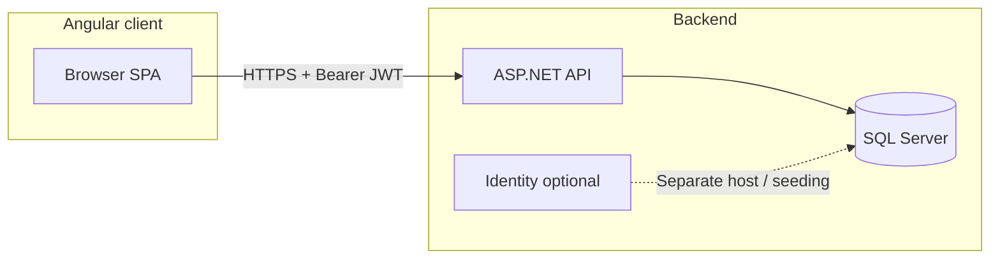

# JobSpot

JobSpot is a full-stack **job board** application: users can register, sign in, and manage **postings** (title, description, location, category, listing type, visibility). The solution pairs an **ASP.NET Core 8** REST API with an **Angular 16** SPA and optional **IdentityServer4** host for identity infrastructure.

---

## Architecture

| Layer | Technology | Location |
|--------|------------|----------|
| Web API | ASP.NET Core 8, EF Core 8, SQL Server, Swagger, JWT | `webapp/api` |
| SPA | Angular 16, Angular Material, Bootstrap 5, Axios | `webapp/client` |
| Identity host | IdentityServer4, ASP.NET Core Identity, EF Core | `webapp/Identity` |

The **API** owns business data (users, countries, cities, categories, types, postings) and issues **JWT** tokens for authenticated calls. The **Identity** project is a separate IdentityServer4 application (configuration/operational stores); the API’s `Program.cs` validates JWTs with a shared secret—it does not call IdentityServer on each request in the current setup.



---

## Repository layout

```
JobSpot/
├── webapp/
│   ├── api/              # Main REST API (see api.sln)
│   ├── client/           # Angular application
│   ├── Identity/         # IdentityServer4 + Identity EF stores
│   └── azure-pipelines.yml
└── README.md
```

---

## Prerequisites

- [.NET 8 SDK](https://dotnet.microsoft.com/download)
- [Node.js](https://nodejs.org/) (LTS recommended; matches Angular 16 tooling)
- [SQL Server](https://www.microsoft.com/sql-server) (LocalDB, Express, or full instance)
- Optional: Visual Studio 2022 or VS Code with C# / Angular extensions

> **Note:** `azure-pipelines.yml` references the .NET 7 SDK task while projects target **net8.0**. For CI, align the pipeline with .NET 8 if builds fail on the agent.

---

## Configuration (API)

The API loads **`DotNetEnv`** from a file named **`.env.{Environment}`** in the API project directory (for example `.env.Development` when `ASPNETCORE_ENVIRONMENT=Development`). Values in `appsettings*.json` are **not** used for the database connection or JWT secret in `Program.cs`—those come from environment variables.

Create `webapp/api/.env.Development` (this path is gitignored) with at least:

| Variable | Purpose |
|----------|---------|
| `db_connection_string` | SQL Server connection string for EF Core |
| `jwt_secret` | Symmetric key for signing/validating JWTs (use a long random string) |

Email confirmation, password reset, and SMTP:

| Variable | Purpose |
|----------|---------|
| `email_confirmation_secret` | Secret used in email/reset token flows |
| `api_url` | Public base URL of the API (e.g. links in emails) |
| `frontend_url` | SPA URL for redirects/links |
| `smtp_server` | SMTP host |
| `smtp_user` / `smtp_pass` | SMTP credentials |

Never commit real secrets. Rotate any credentials that were ever checked into `appsettings.json`.

---

## Database (API)

EF Core migrations live under `webapp/api/Migrations`. Apply them after setting `db_connection_string`:

```bash
cd webapp/api
dotnet ef database update
```

*(Requires the EF Core tools: `dotnet tool install --global dotnet-ef` if needed.)*

---

## Run locally

### 1. API

```bash
cd webapp/api
dotnet run --launch-profile https
```

Default URLs from `launchSettings.json`: **https://localhost:7208** and **http://localhost:5020**. In Development, **Swagger UI** is enabled at `/swagger`.

### 2. Angular client

Point the client at your API. Set `apiUrl` in `webapp/client/src/env/environment.ts` to match the API (e.g. `https://localhost:7208/`).

```bash
cd webapp/client
npm install
npm start
```

The dev server is typically **http://localhost:4200**. Routes include `/`, `/login`, `/register`, `/admin-panel`, and a catch-all 404 route.

### 3. Identity project (optional)

Uses `ConnectionStrings:DefaultConnection` in `webapp/Identity/appsettings.json` (or overrides). HTTPS profile can run with `/seed` to seed IdentityServer configuration (see `Program.cs`).

```bash
cd webapp/Identity
dotnet run --launch-profile https
```

---

## API surface (high level)

Controllers use PascalCase route prefixes (e.g. `Country`, `City`, `Category`, `Type`, `Posting`) with CRUD-style actions such as `GetAll`, `GetById/{Id}`, `Insert`, `Update/{Id}`, `Delete/{Id}`.

**User** routes (`/user`):

- `POST /user/login`, `POST /user/register`
- `GET /user/confirm_email/{token}`
- `GET /user/get_user` (authorized)
- `GET /user/assign_admin/{user_id}`, `GET /user/revoke_admin/{user_id}` (admin policy: claim `isAdmin` = `True`)
- `GET /user/reset_password/{email}`, `PATCH /user/set_new_password`

Swagger documents Bearer JWT: use **Authorize** with a token from login/register flows.

---

## CORS

The API allows **any origin, method, and header** (`AllowAnyOrigin`). For production, restrict origins to your deployed SPA URL.

---

## CI / deployment

`webapp/azure-pipelines.yml` restores and builds the API project, publishes it, and uploads artifacts via FTP. Secure **FTP_USERNAME** and **FTP_PASSWORD** as pipeline secrets; do not hard-code them.

---

## License

Add a license file or terms here if the project is public or shared.
